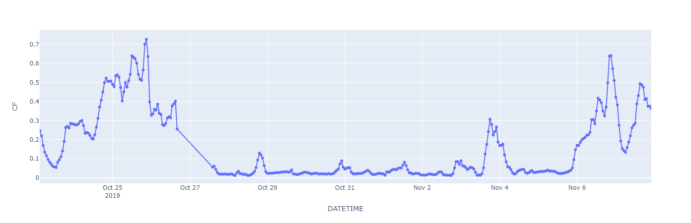
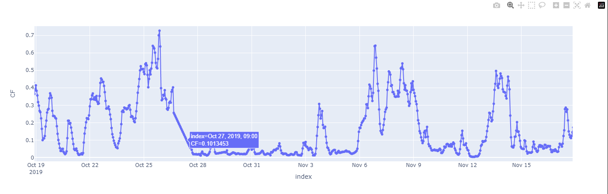
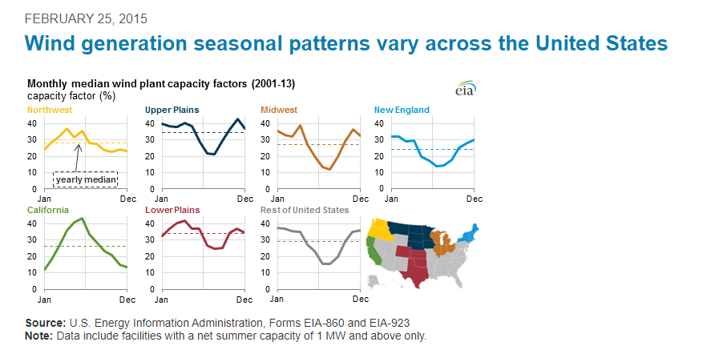
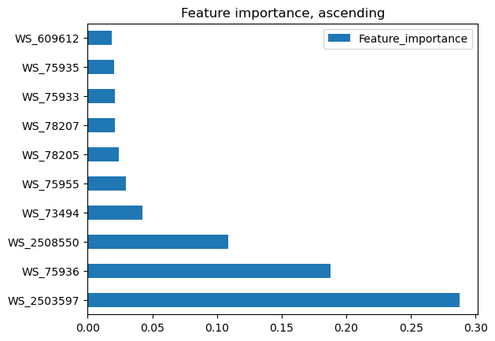
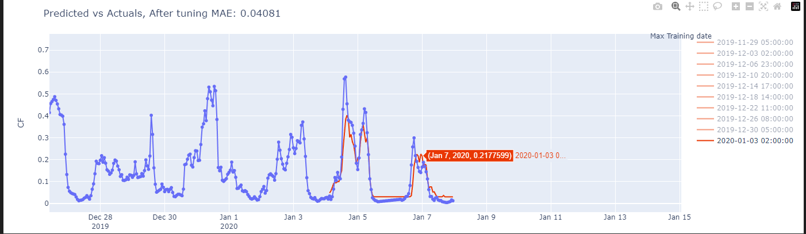
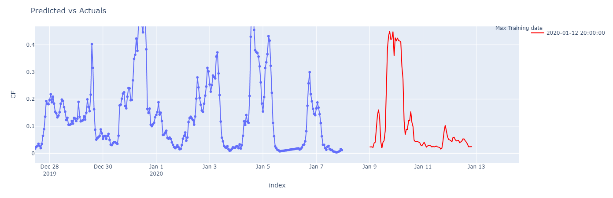

## Vistra Wind Power Generation Model 

- The repository is divided into 4 folders  
- The notebooks 01xx.ipynb -> 06xx.ipynb are utilized for data exploration, feature engineering, model development, testing, hypertuning, and prediction  
- The data folder contains raw data, transformed data, and visuals for analysis  
- The src folder is a module for functions and constants that can be used for productionlizing the code  
    - ChatGPT is utilized to create comments and enhancing the function definitions

## Data Exploration

- The data contains hourly observations from 7th August,2019 to 7th January, 2020    
- There are 16 days where all 24 hours of data are not present
- October 27th has the least amount of observations, as indicated in the straight line
    
- To maintain continuity of the temporal sequence, the missing observations are imputed using linear interpolation. Linear Interpolated data shown for October 27th,2019  
    
- There is daily seasonality as well as a decreasing trend in the electricity output based on current data
- The seasonal pattern of wind energy as described by the EIA, is not captured here since the training set does not include multiple years of data. Additional data could enable more accurate predictions.    
    
- The trend indicates that the wind farms could be either California or Northwest region

## Model Selected
- The lag features and date time features do not rank high in the feature importance. However, `WS_2503597` is the most important feature.
    
- XGBoost model has been utilized to predict the values. An MAE of 0.0408 is achieved as performance on a 10 fold train test set.   
- Comparison of results with baseline and LightGBM provided evidence that a tuned XGBoost me lodel performs better. The XGBoost model is tuned using Grid search 
    

- The final predicted results for Jan 9th to Jan 12th, are shown below 
    

## Next Steps/ Notes

- As next steps, VARIMA/Prophet models can be tested to check if the patterns could be better mapped with statistical models
- The current model utilizes a direct multi-step(93 steps) forecast. A recursive multi-step prediction could also be tested. Testing for 24 steps did not lead to any significant improvement.      
- Pipelines can be created to make the model training and testing more seamless. It has not been implemented, currently.
    - There are a few additional functions that need to be created and then these could be transformed using transformer function to create the pipeline.
- There are around 16 days which do not have values every hour. This could be investigated to ascertain the cause of the same. Current assumptions are that the data was not captured. If there were events that allude to different issues, such as planned maintenance or shut downs, then these could be incoorporated as feaetures in the data set.
- The data files have been comitted to git here since it is a small data excercise, in practice we would not commit data to a git repo.

